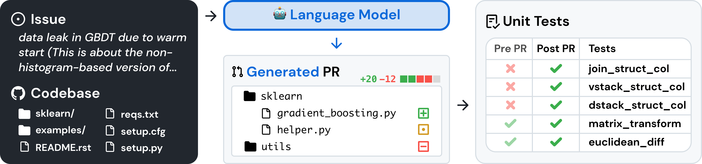
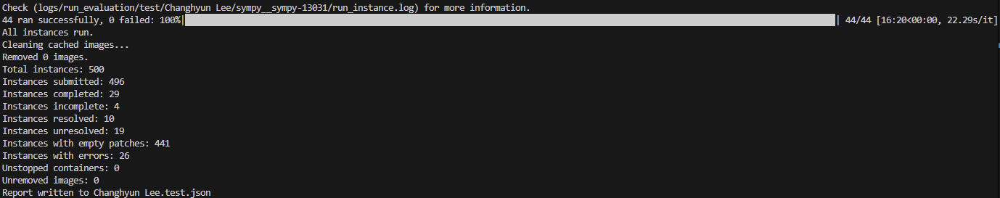

# SWE-bench Verified

## 👋 Overview
SWE-bench is a benchmark for evaluating large language models on real world software issues collected from GitHub. Given a codebase and an issue, a language model is tasked with generating a patch that resolves the described problem.



To access SWE-bench, copy and run the following code:
```
from datasets import load_dataset
swebench = load_dataset('princeton-nlp/SWE-bench', split='test')
```

## 🚀 Purpose of this project 
The goal is to achieve a high resolved score on the SWE-bench Verified test and ultimately make it onto the leaderboard. We exclusively use open-source language models that can run on 12GB of vRAM.

## ⏳ Process
CodeT5 is used to generate an initial patch, and the result is then refined using DeepSeek. CodeT5 focuses on understanding and analyzing code, while DeepSeek specializes in comprehending user queries and refining the output based on CodeT5's results.
CodeT5 is fine-tuned to analyze and modify code with a strong focus on bug fixing. The final response is generated by taking CodeT5’s output and the user query as inputs, evaluating the response, and making necessary modifications.

## ✅ Result
Fine-tuning CodeT5 and using it to generate initial patch code does not work properly. If fine-tuning is necessary, refer to the code, improve it, and use it accordingly.  
CodeT5 is not suitable due to its 512 input token limitation. It is recommended to use alternatives such as StarCoder, CodeParrot, or CodeLlama.

### DeepSeek-R1-Distill-Qwen-7B Result
```
Total instances: 500
Instances submitted: 498
Instances completed: 15
Instances incomplete: 2
Instances resolved: 8
Instances unresolved: 7
Instances with empty patches: 471
Instances with errors: 12
Unstopped containers: 0
Unremoved images: 0
```


```
Total instances: 500
Instances submitted: 496
Instances completed: 29
Instances incomplete: 4
Instances resolved: 10
Instances unresolved: 19
Instances with empty patches: 441
Instances with errors: 26
Unstopped containers: 0
Unremoved images: 0
```
